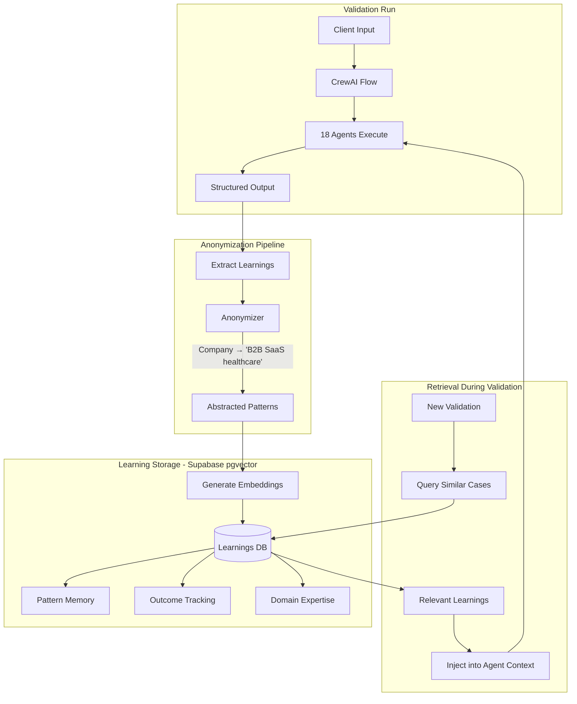

# Flywheel Learning System Architecture

> **VPD Framework**: The Flywheel System captures patterns from Value Proposition Design implementations. See phase documents for VPD patterns:
> - [04-phase-0-onboarding.md](../04-phase-0-onboarding.md) - Founder's Brief patterns
> - [05-phase-1-vpc-discovery.md](../05-phase-1-vpc-discovery.md) - VPC discovery patterns (Jobs, Pains, Gains)
> - [06-phase-2-desirability.md](../06-phase-2-desirability.md) - Desirability validation patterns
> - [07-phase-3-feasibility.md](../07-phase-3-feasibility.md) - Feasibility validation patterns
> - [08-phase-4-viability.md](../08-phase-4-viability.md) - Viability and decision patterns

## Executive Summary

The Flywheel Learning System is StartupAI's competitive moat. Every validation run makes all 6 AI Founders smarter by capturing patterns, outcomes, and domain expertise in a shared, anonymized knowledge base. This document specifies the technical architecture for this system.

**Key Principles**:
- Shared learning across all clients (cumulative intelligence)
- Strict anonymization (no PII, no identifiable data)
- Per-founder retrieval (relevant context for each role)
- Outcome tracking (learn from what worked and what didn't)

---

## Architecture Overview



---

## Learning Types

### 1. Pattern Memory
**What**: Successful validation approaches that can be reused
**Examples**:
- VPC discovery patterns for specific industries
- Experiment designs that generated strong signals
- Pivot triggers that proved reliable

### 2. Outcome Tracking
**What**: Which recommendations led to good/bad outcomes
**Examples**:
- "Proceed" recommendations that validated successfully
- "Pivot" recommendations that unlocked new opportunities
- Assumptions that consistently proved false in certain contexts

### 3. Domain Expertise
**What**: Industry-specific knowledge accumulated from validations
**Examples**:
- Healthcare regulatory patterns
- B2B SaaS pricing benchmarks
- Marketplace chicken-and-egg dynamics

---

## VPD Framework Learning Patterns

### Customer Profile Pattern Library

Learning patterns specific to VPD Customer Profile discovery:

| Pattern Type | What's Learned | Example |
|--------------|----------------|---------|
| **Jobs Resonance** | Which job statements resonate by industry/segment | "When managing remote teams, I want to track productivity without micromanaging" |
| **Pain Severity** | Which pain types are most severe in segments | Healthcare: compliance > UX; Fintech: security > speed |
| **Gain Relevance** | Which gains are essential vs nice-to-have | B2B: reliability > features; B2C: delight > reliability |

#### Jobs-to-be-Done Library Structure

```json
{
  "learning_type": "pattern",
  "pattern_type": "customer_profile_jobs",
  "industry": "B2B SaaS",
  "segment": "HR Tech",
  "job_category": "functional",
  "job_statement": "When onboarding new employees, I want to automate paperwork so I can focus on culture integration",
  "resonance_rate": 0.78,
  "validation_count": 12,
  "associated_pains": ["manual data entry", "compliance risk", "delayed productivity"],
  "associated_gains": ["faster time-to-productivity", "error reduction", "employee satisfaction"]
}
```

#### Retrieval Query Pattern
```python
# When Sage discovers customer jobs
learnings = LearningRetrievalTool()._run(
    query="Jobs-to-be-done patterns for B2B HR Tech segment",
    founder="sage",
    learning_type="pattern",
    pattern_type="customer_profile_jobs",
    industry="B2B SaaS",
    limit=10
)
```

### Value Map Antipattern Learning

Patterns of value propositions that failed validation:

| Antipattern | Description | Signal | Industry |
|-------------|-------------|--------|----------|
| **Generic Pain Reliever** | "Saves time" without specificity | High zombie_ratio (>0.7) | All |
| **Feature Dump** | Too many features, no clear benefit | Low problem_resonance (<0.3) | B2B |
| **Solution Looking for Problem** | No validated customer job | Segment pivot triggered | All |
| **Price-Value Mismatch** | Premium features at budget price | WTP test failure | B2B SaaS |

#### Value Map Failure Pattern Structure

```json
{
  "learning_type": "outcome",
  "outcome_type": "value_map_failure",
  "title": "Generic productivity claims fail in enterprise HR",
  "value_map_element": "pain_reliever",
  "failed_claim": "Save 10 hours per week on HR tasks",
  "evidence": {
    "zombie_ratio": 0.82,
    "problem_resonance": 0.45,
    "sample_size": 500
  },
  "what_failed": "Generic time-saving claims lack credibility with enterprise buyers",
  "what_worked_instead": "Specific compliance risk reduction with audit trail",
  "confidence_score": 0.86
}
```

### Experiment Selection Learning

Which TBI experiments work best for which hypothesis types:

| Hypothesis Type | Best Experiment | Effectiveness | Cost/Speed |
|-----------------|-----------------|---------------|------------|
| **Customer Jobs (functional)** | Contextual inquiry interviews | 0.92 | Low/Medium |
| **Customer Jobs (social)** | Social listening + interviews | 0.78 | Low/Fast |
| **Customer Pains** | Pain interviews + review mining | 0.88 | Low/Fast |
| **Customer Gains** | Feature voting + interviews | 0.85 | Low/Medium |
| **Pain Relievers** | A/B landing page tests | 0.82 | Medium/Fast |
| **Gain Creators** | Prototype usability tests | 0.79 | Medium/Medium |
| **Willingness to Pay** | Van Westendorp + A/B pricing | 0.90 | Medium/Fast |

#### Experiment Effectiveness Learning Structure

```json
{
  "learning_type": "pattern",
  "pattern_type": "experiment_effectiveness",
  "hypothesis_type": "customer_jobs",
  "experiment_type": "contextual_inquiry_interviews",
  "tbi_experiment_id": "T1.1",
  "effectiveness_score": 0.92,
  "sample_projects": 45,
  "cost_category": "low",
  "speed_category": "medium",
  "best_for": ["functional jobs", "B2B segments"],
  "avoid_for": ["B2C mass market", "emotional jobs"],
  "evidence_type": "say",
  "typical_sample_size": 15
}
```

### Cross-Canvas Learning Patterns

How VPC signals predict BMC outcomes:

| VPC Signal | BMC Implication | Correlation |
|------------|-----------------|-------------|
| High job importance + low pain severity | Gain creator focus → Premium positioning | 0.82 |
| High pain severity + multiple alternatives | Pain reliever focus → Feature differentiation | 0.78 |
| Strong problem_resonance + high zombie_ratio | Value proposition needs stronger commitment driver | 0.91 |
| Low problem_resonance across segments | Customer segment hypothesis invalid | 0.95 |

#### Cross-Canvas Pattern Structure

```json
{
  "learning_type": "pattern",
  "pattern_type": "cross_canvas_signal",
  "source_canvas": "vpc",
  "target_canvas": "bmc",
  "signal_combination": {
    "problem_resonance": ">0.6",
    "zombie_ratio": ">0.7"
  },
  "implication": "Revenue Streams block needs stronger commitment mechanism",
  "recommended_actions": [
    "Add skin-in-game pricing tier",
    "Implement pilot program with deposit",
    "Create limited-time founding member offer"
  ],
  "correlation_strength": 0.91,
  "sample_projects": 23
}
```

### Fit Score Progression Learning

How fit scores progress through validation cycles:

| Starting Fit | Typical Progression | Success Rate |
|--------------|--------------------|--------------|
| < 40 | Usually requires segment pivot | 15% |
| 40-55 | 2-3 iterations to reach 70 | 45% |
| 55-70 | 1-2 iterations to reach 70 | 75% |
| > 70 | Minor refinements only | 90% |

---

## Innovation Physics Learning Examples

### How Innovation Physics Signals Feed the Flywheel

Innovation Physics routing decisions create valuable learnings that improve future validation runs:

#### Example 1: Zombie Ratio Pattern Learning

**Validation Run #47 - B2B SaaS in Healthcare**:
- **Evidence**: `problem_resonance: 0.72`, `zombie_ratio: 0.85` (85% interested but not committing)
- **Router Decision**: `VALUE_PIVOT` triggered
- **Human Decision**: Founder increased price 2x, added enterprise features
- **Outcome**: Second desirability test showed `zombie_ratio: 0.15`, `strong_commitment` signal
- **Learning Captured**:

```json
{
  "learning_type": "pattern",
  "founder": "compass",
  "phase": "desirability",
  "title": "High zombie ratio in B2B requires enterprise positioning",
  "description": "When problem_resonance > 0.7 but zombie_ratio > 0.8 in B2B contexts, buyers show interest but won't commit. Pivot to higher price point with enterprise features to convert zombies to committed buyers.",
  "context_abstract": "B2B SaaS in healthcare at early revenue stage",
  "tags": ["zombie_ratio", "value_pivot", "b2b", "pricing"],
  "pattern_type": "pivot_signal",
  "situation": "Strong problem resonance (>0.7) but very high zombie ratio (>0.8) in B2B segment",
  "approach": "Increase price 2x and add enterprise-grade features (SSO, audit logs, compliance)",
  "outcome": "Zombie ratio dropped to 0.15; strong commitment signal achieved",
  "confidence_score": 0.92
}
```

**Future Retrieval**: When Compass sees `problem_resonance: 0.68` + `zombie_ratio: 0.82` in another B2B SaaS validation, the retrieval tool surfaces this pattern as relevant context.

#### Example 2: Segment Pivot Outcome Tracking

**Validation Run #63 - Consumer FinTech**:
- **Evidence**: `problem_resonance: 0.18` (customers don't care about the problem)
- **Router Decision**: `SEGMENT_PIVOT` required
- **Human Decision**: Founder rejected pivot, insisted on original segment
- **Outcome**: After 2 more experiments, still `problem_resonance < 0.2`, project killed
- **Learning Captured**:

```json
{
  "learning_type": "outcome",
  "founder": "sage",
  "phase": "desirability",
  "title": "Rejecting segment pivot at problem_resonance < 0.2 leads to kill",
  "description": "When Problem-Solution Filter triggers (problem_resonance < 0.3), rejecting segment pivot and retesting same audience yields no improvement. Pattern observed across 5 projects.",
  "context_abstract": "Consumer fintech at pre-seed stage",
  "tags": ["segment_pivot", "problem_resonance", "kill_decision"],
  "recommendation_type": "pivot",
  "recommendation_text": "Change customer segment - current audience doesn't care about problem",
  "actual_outcome": "invalidated",
  "what_worked": "N/A - pivot was rejected",
  "what_failed": "Retesting same audience with low problem resonance",
  "adjustment_made": "None - founder rejected recommendation, project killed after 3 cycles",
  "evidence_strength": "strong",
  "sample_size": 15000,
  "confidence_score": 0.88
}
```

**Future Retrieval**: When Sage sees `problem_resonance: 0.21` in a similar validation, the system surfaces this outcome to reinforce the pivot recommendation.

#### Example 3: CAC/LTV Ratio Domain Expertise

**Validation Run #89 - B2B Marketplace**:
- **Evidence**: `cac_usd: 450`, `ltv_usd: 380`, `ltv_cac_ratio: 0.84`
- **Router Decision**: `STRATEGIC_PIVOT` required (CAC > LTV)
- **Human Decision**: Founder chose `COST_PIVOT` (reduce acquisition costs)
- **Outcome**: Feature downgrade + organic growth channels reduced CAC to $180, LTV remained $380
- **Learning Captured**:

```json
{
  "learning_type": "domain",
  "founder": "ledger",
  "phase": "viability",
  "title": "Two-sided marketplaces: CAC reduction via organic growth outperforms price increase",
  "description": "In two-sided marketplaces, reducing CAC through organic channels (referrals, SEO) is more effective than increasing pricing. Pricing changes risk chicken-and-egg imbalance.",
  "context_abstract": "B2B marketplace at early revenue stage",
  "tags": ["marketplace", "cac_ltv", "cost_pivot", "unit_economics"],
  "industry": "marketplace",
  "business_model": "two-sided",
  "insight_type": "market_dynamic",
  "insight": "Two-sided marketplaces have natural CAC reduction opportunities through network effects and organic growth. Price increases risk supply/demand imbalance. Prioritize COST_PIVOT over PRICE_PIVOT.",
  "geographic_scope": "US",
  "temporal_relevance": "2024",
  "evidence_basis": "5 marketplace validations with CAC > LTV; 4/5 succeeded with cost reduction, 0/1 with price increase",
  "confidence_score": 0.85
}
```

**Future Retrieval**: When Ledger evaluates unit economics for another marketplace and sees `ltv_cac_ratio < 1.0`, this domain expertise guides the recommendation toward cost reduction rather than pricing experiments.

#### Example 4: Feasibility Downgrade Pattern

**Validation Run #112 - SaaS AI Platform**:
- **Evidence**: `feasibility_status: ORANGE_CONSTRAINED` (AI model too expensive to run profitably)
- **Router Decision**: `FEATURE_PIVOT` (downgrade to lite version)
- **Human Decision**: Approved downgrade; removed real-time AI, kept batch processing
- **Outcome**: Downgraded version still had `problem_resonance: 0.61`, `zombie_ratio: 0.25` (customers accepted tradeoff)
- **Learning Captured**:

```json
{
  "learning_type": "pattern",
  "founder": "forge",
  "phase": "feasibility",
  "title": "AI features: batch processing acceptable substitute for real-time",
  "description": "When real-time AI features are infeasible due to compute costs, batch processing (results in 1-4 hours) maintains acceptable desirability for B2B use cases. Problem resonance drops <20% if batch SLA is clear.",
  "context_abstract": "B2B SaaS with AI features at seed stage",
  "tags": ["feasibility", "downgrade", "ai", "cost_optimization"],
  "pattern_type": "experiment_design",
  "situation": "AI feature too expensive for real-time execution; feasibility_status = ORANGE_CONSTRAINED",
  "approach": "Downgrade to batch processing with clear SLA (1-4 hour results); test desirability with lite version",
  "outcome": "Problem resonance remained strong (0.61); zombie ratio acceptable (0.25); customers accepted tradeoff when value prop focused on accuracy over speed",
  "applicable_when": {
    "feasibility_signal": "ORANGE_CONSTRAINED",
    "cost_driver": "compute_intensive_ai",
    "customer_segment": "B2B"
  },
  "counter_indicators": {
    "use_case_requires_realtime": true,
    "customer_segment": "B2C"
  },
  "confidence_score": 0.79
}
```

**Future Retrieval**: When Forge encounters expensive AI features in feasibility assessment, this pattern suggests batch processing as a viable downgrade option.

### Retrieval in Action

When a new validation run starts, agents query relevant learnings:

**Example Query** (Pulse running desirability experiments for B2B SaaS):
```python
learnings = LearningRetrievalTool()._run(
    query="Desirability experiment patterns for B2B SaaS with high traffic but low conversion",
    founder="pulse",
    learning_type="pattern",
    industry="B2B SaaS",
    limit=5
)
```

**Retrieved Learnings** (formatted for agent context):
```markdown
## Relevant Learnings from Past Validations

### 1. High zombie ratio in B2B requires enterprise positioning
**Pattern** | B2B SaaS in healthcare | Confidence: 0.92

When problem_resonance > 0.7 but zombie_ratio > 0.8 in B2B contexts, buyers show interest but won't commit. Pivot to higher price point with enterprise features to convert zombies to committed buyers.

**What Worked**: Increased price 2x and added enterprise-grade features (SSO, audit logs, compliance)
**Result**: Zombie ratio dropped from 0.85 to 0.15; strong commitment signal achieved

### 2. B2B landing pages: feature comparison tables outperform hero shots
**Pattern** | B2B SaaS in various industries | Confidence: 0.84

Landing pages with detailed feature comparison tables generate 2.3x higher signup rates than hero image + value prop for B2B audiences.

### ... (3 more relevant patterns)
```

This context is automatically injected into Pulse's creative generation task, improving the quality of initial experiments.

---

## Data Model

### Database Schema (Supabase PostgreSQL + pgvector)

```sql
-- Enable pgvector extension
CREATE EXTENSION IF NOT EXISTS vector;

-- Main learnings table
CREATE TABLE learnings (
    id UUID PRIMARY KEY DEFAULT gen_random_uuid(),
    created_at TIMESTAMPTZ DEFAULT NOW(),

    -- Classification
    learning_type TEXT NOT NULL CHECK (learning_type IN ('pattern', 'outcome', 'domain')),
    founder TEXT NOT NULL CHECK (founder IN ('sage', 'forge', 'pulse', 'compass', 'guardian', 'ledger')),
    phase TEXT NOT NULL CHECK (phase IN ('desirability', 'feasibility', 'viability')),

    -- Content (anonymized)
    title TEXT NOT NULL,
    description TEXT NOT NULL,
    context_abstract TEXT NOT NULL,  -- "B2B SaaS in healthcare" not "HealthTech Inc"

    -- Structured data
    tags TEXT[] DEFAULT '{}',
    industry TEXT,
    business_model TEXT,  -- "subscription", "marketplace", "freemium"
    customer_segment TEXT,  -- "B2B", "B2C", "B2B2C"

    -- Vector for similarity search
    embedding vector(1536),  -- OpenAI text-embedding-ada-002

    -- Provenance (anonymized)
    validation_run_id UUID,  -- Internal tracking only
    confidence_score FLOAT CHECK (confidence_score >= 0 AND confidence_score <= 1)
);

-- Pattern memory: successful validation approaches
CREATE TABLE patterns (
    id UUID PRIMARY KEY DEFAULT gen_random_uuid(),
    learning_id UUID REFERENCES learnings(id) ON DELETE CASCADE,

    pattern_type TEXT NOT NULL,  -- "vpc_discovery", "experiment_design", "pivot_signal"

    -- The pattern itself
    situation TEXT NOT NULL,      -- When to apply
    approach TEXT NOT NULL,       -- What worked
    outcome TEXT NOT NULL,        -- Result achieved

    -- Retrieval optimization
    applicable_when JSONB,        -- Structured conditions
    counter_indicators JSONB      -- When NOT to use
);

-- Outcome tracking: what recommendations led to
CREATE TABLE outcomes (
    id UUID PRIMARY KEY DEFAULT gen_random_uuid(),
    learning_id UUID REFERENCES learnings(id) ON DELETE CASCADE,

    recommendation_type TEXT NOT NULL,  -- "proceed", "pivot", "kill"
    recommendation_text TEXT NOT NULL,

    -- Outcome data (captured if available)
    actual_outcome TEXT,               -- "validated", "invalidated", "partial"
    outcome_captured_at TIMESTAMPTZ,

    -- Evidence quality
    evidence_strength TEXT CHECK (evidence_strength IN ('strong', 'moderate', 'weak')),
    sample_size INT,

    -- Learning extracted
    what_worked TEXT,
    what_failed TEXT,
    adjustment_made TEXT
);

-- Domain expertise: industry-specific knowledge
CREATE TABLE domain_expertise (
    id UUID PRIMARY KEY DEFAULT gen_random_uuid(),
    learning_id UUID REFERENCES learnings(id) ON DELETE CASCADE,

    industry TEXT NOT NULL,
    sub_domain TEXT,

    -- Knowledge captured
    insight_type TEXT NOT NULL,  -- "market_dynamic", "customer_behavior", "regulatory", "competitive"
    insight TEXT NOT NULL,

    -- Context
    geographic_scope TEXT,       -- "US", "EU", "global"
    temporal_relevance TEXT,     -- "evergreen", "2024", "pre-2023"

    -- Sources (anonymized references)
    evidence_basis TEXT
);

-- Indexes for efficient retrieval
CREATE INDEX idx_learnings_embedding ON learnings
    USING ivfflat (embedding vector_cosine_ops) WITH (lists = 100);
CREATE INDEX idx_learnings_type_founder ON learnings (learning_type, founder);
CREATE INDEX idx_learnings_phase ON learnings (phase);
CREATE INDEX idx_learnings_industry ON learnings (industry);
CREATE INDEX idx_patterns_type ON patterns (pattern_type);
CREATE INDEX idx_domain_industry ON domain_expertise (industry);
```

### Similarity Search Function

```sql
CREATE OR REPLACE FUNCTION match_learnings(
    query_embedding vector(1536),
    match_threshold float,
    match_count int,
    filter_founder text DEFAULT NULL,
    filter_type text DEFAULT NULL,
    filter_industry text DEFAULT NULL
)
RETURNS TABLE (
    id uuid,
    title text,
    description text,
    context_abstract text,
    learning_type text,
    confidence_score float,
    similarity float
)
LANGUAGE plpgsql
AS $$
BEGIN
    RETURN QUERY
    SELECT
        l.id,
        l.title,
        l.description,
        l.context_abstract,
        l.learning_type,
        l.confidence_score,
        1 - (l.embedding <=> query_embedding) as similarity
    FROM learnings l
    WHERE
        1 - (l.embedding <=> query_embedding) > match_threshold
        AND (filter_founder IS NULL OR l.founder = filter_founder)
        AND (filter_type IS NULL OR l.learning_type = filter_type)
        AND (filter_industry IS NULL OR l.industry = filter_industry)
    ORDER BY l.embedding <=> query_embedding
    LIMIT match_count;
END;
$$;
```

---

## Anonymization Pipeline

### What Gets Anonymized

| Data Type | Action | Example |
|-----------|--------|---------|
| Company names | Abstract | "Acme Corp" → "the company" |
| Founder names | Abstract | "John Smith" → "the founder" |
| Email addresses | Redact | "john@acme.com" → "[REDACTED]" |
| Phone numbers | Redact | "555-1234" → "[REDACTED]" |
| Specific URLs | Redact | Domain info removed |
| Revenue figures | Abstract | "$1.2M ARR" → "early revenue stage" |
| Specific product features | Abstract | "AI-powered scheduling" → "core feature" |

### What Gets Preserved

| Data Type | Reason |
|-----------|--------|
| Industry | Critical for pattern matching |
| Business model | Essential context |
| Customer segment | Retrieval relevance |
| Stage | Contextual accuracy |
| Geographic scope | Regulatory patterns |

### Anonymizer Tool Specification

**Location**: `src/startupai/tools/anonymizer.py`

```python
class Anonymizer:
    """Strip PII and abstract identifying information"""

    def anonymize_text(self, text: str, entities: Dict[str, str]) -> str:
        """
        Remove PII and replace known entities with abstractions.

        Args:
            text: Raw text to anonymize
            entities: Known entities {"Acme Corp": "company_name"}

        Returns:
            Anonymized text safe for storage
        """

    def abstract_context(self, context: Dict[str, Any]) -> str:
        """
        Convert specific business context to abstract description.

        Input:  {"company": "HealthTech Inc", "industry": "Healthcare",
                 "model": "B2B SaaS", "stage": "Pre-seed"}
        Output: "B2B SaaS in healthcare at pre-seed stage"
        """

    def extract_safe_learning(
        self,
        raw_output: Dict[str, Any],
        entity_map: Dict[str, str]
    ) -> Dict[str, Any]:
        """
        Process crew output into anonymized learning.
        Main entry point called after each validation run.
        """
```

### Privacy Guard Specification

**Location**: `src/startupai/tools/privacy_guard.py`

```python
class PrivacyGuard:
    """Final check before any data enters the learning database"""

    def check_for_violations(self, text: str) -> List[str]:
        """Return list of potential privacy violations"""

    def safe_for_storage(self, text: str) -> bool:
        """Final gate before storing - returns True only if clean"""

    def enforce(self, learning: Dict) -> Dict:
        """
        Enforce privacy rules. Either clean or reject.
        Raises PrivacyViolationError if cannot safely anonymize.
        """
```

---

## Learning Capture

### When Learnings Are Captured

1. **After each phase completion** - Patterns from successful phase transitions
2. **On pivot/proceed decisions** - Outcome tracking for recommendations
3. **On validation completion** - Domain expertise accumulated
4. **On Guardian QA feedback** - Quality patterns

### Learning Capture Tool

**Location**: `src/startupai/tools/learning_capture.py`

```python
class LearningCaptureTool(BaseTool):
    """Capture learnings after validation tasks"""

    name: str = "capture_learning"
    description: str = """
    Store a learning for future validations.
    Call after significant validation outcomes.
    """

    def _run(
        self,
        learning_type: str,    # "pattern", "outcome", "domain"
        title: str,
        description: str,
        context: dict,         # Business context
        founder: str,          # Which founder's domain
        phase: str,            # desirability/feasibility/viability
        tags: List[str] = None,
        confidence_score: float = None
    ) -> str:
        """
        Anonymize and store the learning.
        Returns confirmation message.
        """
```

### Integration with Flow

```python
@listen("approved")
def capture_phase_learnings(self):
    """After Guardian approves, capture learnings"""

    # Extract learnings from this phase
    learnings = self.extract_learnings_from_state()

    for learning in learnings:
        LearningCaptureTool()._run(
            learning_type=learning['type'],
            title=learning['title'],
            description=learning['description'],
            context=self.state.brief.get_abstract_context(),
            founder=learning['founder'],
            phase=self.state.current_phase,
            tags=learning.get('tags', []),
            confidence_score=learning.get('confidence')
        )
```

---

## Learning Retrieval

### Per-Founder Query Patterns

| Founder | Queries For | Example Queries |
|---------|-------------|-----------------|
| **Sage** | VPC patterns, customer research | "Customer discovery patterns for B2B SaaS", "Jobs-to-be-done in healthcare" |
| **Forge** | Technical feasibility, architecture | "MVP scope decisions for marketplace", "Technical debt tradeoffs" |
| **Pulse** | Experiment designs, growth signals | "Landing page experiments for B2C", "Ad copy patterns that convert" |
| **Compass** | Synthesis patterns, pivot signals | "Pivot triggers in fintech", "Evidence thresholds for proceed" |
| **Guardian** | QA patterns, compliance | "Common VPC quality issues", "Compliance patterns in healthcare" |
| **Ledger** | Unit economics, pricing | "Pricing experiments for SaaS", "CAC/LTV patterns by industry" |

### Learning Retrieval Tool

**Location**: `src/startupai/tools/learning_retrieval.py`

```python
class LearningRetrievalTool(BaseTool):
    """Query the shared learning database"""

    name: str = "retrieve_learnings"
    description: str = """
    Search for relevant patterns, outcomes, and expertise.
    Use before making recommendations to leverage collective intelligence.
    """

    def _run(
        self,
        query: str,
        founder: str,
        learning_type: str = None,
        industry: str = None,
        limit: int = 5
    ) -> str:
        """
        Retrieve relevant learnings formatted for agent context.

        Returns formatted string with relevant learnings.
        """
```

### Agent Integration

```python
# In agent definition
def customer_researcher(self) -> Agent:
    return Agent(
        role="Customer Researcher",
        goal="Deeply understand customer jobs, pains, and gains",
        backstory="...",
        tools=[
            LearningRetrievalTool()  # Can query past learnings
        ]
    )

# In task definition
customer_research_task:
  description: |
    Before starting research, query the learning database for relevant
    patterns using the retrieve_learnings tool with:
    - query: "Customer research patterns for {industry} {business_model}"
    - founder: "sage"
    - learning_type: "pattern"

    Use these learnings to inform your research approach.

    Then conduct customer research for the {segment} segment...
```

---

## Privacy Safeguards

### Multi-Layer Protection

1. **Anonymization Layer** - Strip PII at capture time
2. **Privacy Guard Layer** - Final check before storage
3. **Guardian QA Layer** - Audit stored learnings periodically
4. **Retrieval Filtering** - Only return anonymized content

### Guardian Data Leakage Check

```python
class DataLeakageCheckTask:
    """Guardian QA task: verify no PII in outputs"""

    description = """
    Review the following output for any potential data leakage:
    - Company names, founder names, investor names
    - Email addresses, phone numbers, URLs
    - Specific revenue figures that could identify a company
    - Any information that could trace back to a specific client

    If found, flag for redaction before storage.

    Output: {passed: bool, violations: list, recommendations: list}
    """
```

### Periodic Audit

Guardian should periodically audit the learning database:
- Check for patterns that might reveal clients
- Verify abstraction quality
- Ensure temporal relevance (remove stale learnings)

---

## Integration with CrewAI AMP

### What AMP Provides
- Execution environment
- API gateway
- Observability dashboard
- Webhook event streaming

### What We Implement
- Learning capture tools
- Learning retrieval tools
- Anonymization pipeline
- Supabase integration

### Environment Variables (AMP Dashboard)

```env
SUPABASE_URL=https://xxx.supabase.co
SUPABASE_KEY=eyJ...
OPENAI_API_KEY=sk-...  # For embeddings
```

---

## Implementation Phases

### Phase 1: Foundation (With Phase 1 Validation Work)
**Goal**: Basic capture and retrieval
**Status**: ✅ COMPLETE

- [x] Create Supabase tables with pgvector (migration `20251126000001_flywheel_learning.sql`)
  - `learnings` table deployed
  - `patterns` table deployed
  - `outcomes` table deployed
  - `domain_expertise` table deployed (20 rows seeded with industry benchmarks)
- [x] Create search functions
  - `search_learnings()` function deployed
  - `search_patterns()` function deployed
  - `get_domain_expertise()` function deployed
- [x] Implement Anonymizer tool (`src/startupai/tools/anonymizer.py`)
- [x] Implement LearningCaptureTool (`src/startupai/tools/learning_capture.py`)
- [x] Implement LearningRetrievalTool (`src/startupai/tools/learning_retrieval.py`)
- [ ] Implement PrivacyGuard (stub exists, full implementation pending)
- [ ] Integrate into Phase 1 Flow (tools exist, wiring to flow pending)

### Phase 2: Integration (With Phase 2 Validation Work)
**Goal**: Systematic capture across all crews
**Status**: ⏳ NOT STARTED

- [ ] Add tools to all relevant agents
- [ ] Modify Flow to capture learnings after each phase
- [ ] Implement Guardian data leakage check
- [ ] Test anonymization with real outputs

### Phase 3: Optimization (With Phase 3 Validation Work)
**Goal**: High-quality retrieval and outcome tracking
**Status**: ⏳ NOT STARTED

- [ ] Tune embedding similarity thresholds
- [ ] Create founder-specific retrieval patterns
- [ ] Build retrieval quality metrics
- [ ] Implement outcome capture mechanism
- [ ] Build feedback loop for prediction accuracy

---

## Success Metrics

| Metric | Target | Measurement |
|--------|--------|-------------|
| Learning capture rate | 3-5 per validation run | Count per run |
| Retrieval relevance | >70% useful | Agent feedback |
| Anonymization success | 100% PII-free | Privacy audit |
| Outcome tracking | >50% tracked | Outcome capture rate |

---

## Architecture Decision Records

### ADR-001: Supabase pgvector Over External Vector DB
**Decision**: Use Supabase pgvector for learning storage
**Rationale**: Already using Supabase for product app; reduces infrastructure complexity; pgvector is production-ready

### ADR-002: Tool-Based Learning Over Native CrewAI Memory
**Decision**: Implement as custom tools, not CrewAI memory system
**Rationale**: More control over anonymization; works reliably with AMP; easier to audit

### ADR-003: Abstract Context Over Synthetic Data
**Decision**: Abstract to categories ("B2B SaaS in healthcare") rather than generate synthetic replacements
**Rationale**: Maintains truthfulness; easier privacy validation; sufficient for pattern matching

### ADR-004: Per-Founder Retrieval Over Global Context
**Decision**: Query filtered by founder role
**Rationale**: Reduces noise; more relevant results; respects domain boundaries

---

## Files Created

| File | Purpose | Status |
|------|---------|--------|
| `src/startupai/tools/anonymizer.py` | Anonymization pipeline | ✅ Implemented |
| `src/startupai/tools/privacy_guard.py` | Privacy enforcement | ⏳ Stub only |
| `src/startupai/tools/learning_capture.py` | Store learnings | ✅ Implemented |
| `src/startupai/tools/learning_retrieval.py` | Query learnings | ✅ Implemented |
| `20251126000001_flywheel_learning.sql` | Database schema (in app.startupai.site) | ✅ Deployed |

---

## Cross-Repository Dependencies

### This Repo Produces
- Learning capture/retrieval tools ✅ Implemented
- Anonymization pipeline ✅ Implemented
- Integration with crews/flows ⏳ Pending

### Product App (`app.startupai.site`) Provides
- Supabase database hosting ✅ Active
- Learning tables migration ✅ Deployed (`20251126000001_flywheel_learning.sql`)
- pgvector extension setup ✅ Enabled

### Coordination
- ✅ Database schema deployed - tools can now be used
- ⏳ Tools need to be wired to Flow for production use

---

## References

- [02-organization.md](../02-organization.md) - 6 Founders organization
- [04-phase-0-onboarding.md](../04-phase-0-onboarding.md) - Phase 0 specification
- [05-phase-1-vpc-discovery.md](../05-phase-1-vpc-discovery.md) - Phase 1 VPC patterns
- [06-phase-2-desirability.md](../06-phase-2-desirability.md) - Phase 2 patterns
- [07-phase-3-feasibility.md](../07-phase-3-feasibility.md) - Phase 3 patterns
- [08-phase-4-viability.md](../08-phase-4-viability.md) - Phase 4 patterns
- [database-schemas.md](./database-schemas.md) - Supabase schemas including learnings tables
- [ADR-002](../../adr/002-modal-serverless-migration.md) - Modal serverless migration
- CrewAI Memory documentation
- pgvector documentation

---

## Change Log

| Date | Change | Author |
|------|--------|--------|
| 2025-11-21 | Initial specification created | Claude + Chris |
| 2025-11-26 | Updated implementation status - Phase 1 Foundation complete | Claude + Chris |
| 2026-01-05 | Added VPD Framework Learning Patterns (Customer Profile, Value Map, Experiments, Cross-Canvas) | Claude + Chris |
| 2026-01-08 | Fixed cross-references to point to phase documents (04-08) instead of archived specs | Claude + Chris |

---

**This is StartupAI's competitive moat. Every validation makes all 6 Founders smarter.**

> **Authoritative Specs**: See phase documents (04-08) for VPD implementation details.
