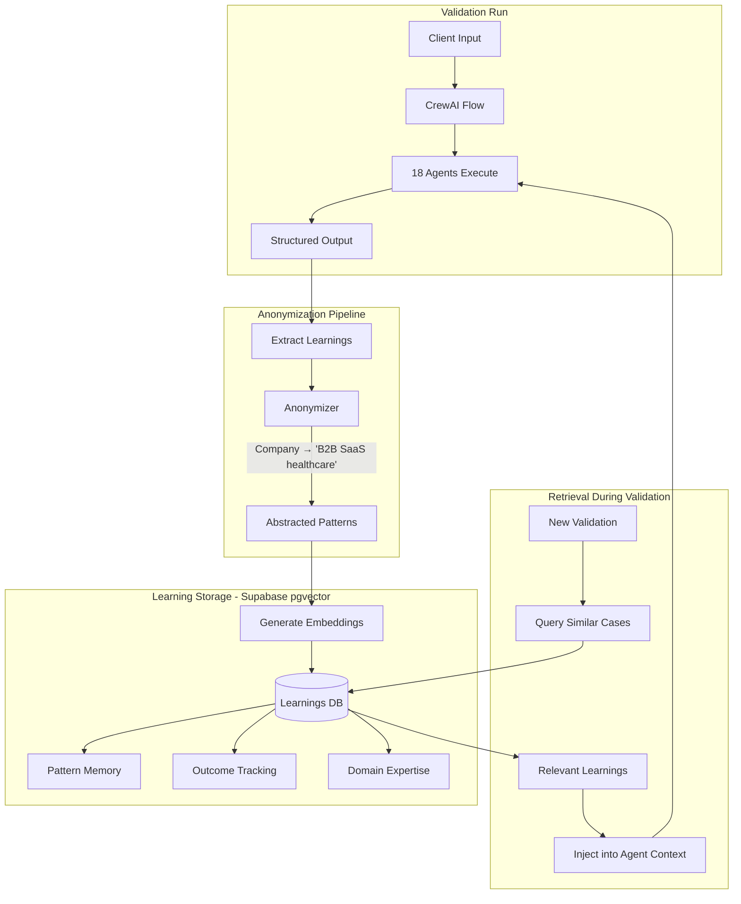

# Flywheel Learning System Architecture

## Executive Summary

The Flywheel Learning System is StartupAI's competitive moat. Every validation run makes all 6 AI Founders smarter by capturing patterns, outcomes, and domain expertise in a shared, anonymized knowledge base. This document specifies the technical architecture for this system.

**Key Principles**:
- Shared learning across all clients (cumulative intelligence)
- Strict anonymization (no PII, no identifiable data)
- Per-founder retrieval (relevant context for each role)
- Outcome tracking (learn from what worked and what didn't)

---

## Architecture Overview



---

## Learning Types

### 1. Pattern Memory
**What**: Successful validation approaches that can be reused
**Examples**:
- VPC discovery patterns for specific industries
- Experiment designs that generated strong signals
- Pivot triggers that proved reliable

### 2. Outcome Tracking
**What**: Which recommendations led to good/bad outcomes
**Examples**:
- "Proceed" recommendations that validated successfully
- "Pivot" recommendations that unlocked new opportunities
- Assumptions that consistently proved false in certain contexts

### 3. Domain Expertise
**What**: Industry-specific knowledge accumulated from validations
**Examples**:
- Healthcare regulatory patterns
- B2B SaaS pricing benchmarks
- Marketplace chicken-and-egg dynamics

---

## Data Model

### Database Schema (Supabase PostgreSQL + pgvector)

```sql
-- Enable pgvector extension
CREATE EXTENSION IF NOT EXISTS vector;

-- Main learnings table
CREATE TABLE learnings (
    id UUID PRIMARY KEY DEFAULT gen_random_uuid(),
    created_at TIMESTAMPTZ DEFAULT NOW(),

    -- Classification
    learning_type TEXT NOT NULL CHECK (learning_type IN ('pattern', 'outcome', 'domain')),
    founder TEXT NOT NULL CHECK (founder IN ('sage', 'forge', 'pulse', 'compass', 'guardian', 'ledger')),
    phase TEXT NOT NULL CHECK (phase IN ('desirability', 'feasibility', 'viability')),

    -- Content (anonymized)
    title TEXT NOT NULL,
    description TEXT NOT NULL,
    context_abstract TEXT NOT NULL,  -- "B2B SaaS in healthcare" not "HealthTech Inc"

    -- Structured data
    tags TEXT[] DEFAULT '{}',
    industry TEXT,
    business_model TEXT,  -- "subscription", "marketplace", "freemium"
    customer_segment TEXT,  -- "B2B", "B2C", "B2B2C"

    -- Vector for similarity search
    embedding vector(1536),  -- OpenAI text-embedding-ada-002

    -- Provenance (anonymized)
    validation_run_id UUID,  -- Internal tracking only
    confidence_score FLOAT CHECK (confidence_score >= 0 AND confidence_score <= 1)
);

-- Pattern memory: successful validation approaches
CREATE TABLE patterns (
    id UUID PRIMARY KEY DEFAULT gen_random_uuid(),
    learning_id UUID REFERENCES learnings(id) ON DELETE CASCADE,

    pattern_type TEXT NOT NULL,  -- "vpc_discovery", "experiment_design", "pivot_signal"

    -- The pattern itself
    situation TEXT NOT NULL,      -- When to apply
    approach TEXT NOT NULL,       -- What worked
    outcome TEXT NOT NULL,        -- Result achieved

    -- Retrieval optimization
    applicable_when JSONB,        -- Structured conditions
    counter_indicators JSONB      -- When NOT to use
);

-- Outcome tracking: what recommendations led to
CREATE TABLE outcomes (
    id UUID PRIMARY KEY DEFAULT gen_random_uuid(),
    learning_id UUID REFERENCES learnings(id) ON DELETE CASCADE,

    recommendation_type TEXT NOT NULL,  -- "proceed", "pivot", "kill"
    recommendation_text TEXT NOT NULL,

    -- Outcome data (captured if available)
    actual_outcome TEXT,               -- "validated", "invalidated", "partial"
    outcome_captured_at TIMESTAMPTZ,

    -- Evidence quality
    evidence_strength TEXT CHECK (evidence_strength IN ('strong', 'moderate', 'weak')),
    sample_size INT,

    -- Learning extracted
    what_worked TEXT,
    what_failed TEXT,
    adjustment_made TEXT
);

-- Domain expertise: industry-specific knowledge
CREATE TABLE domain_expertise (
    id UUID PRIMARY KEY DEFAULT gen_random_uuid(),
    learning_id UUID REFERENCES learnings(id) ON DELETE CASCADE,

    industry TEXT NOT NULL,
    sub_domain TEXT,

    -- Knowledge captured
    insight_type TEXT NOT NULL,  -- "market_dynamic", "customer_behavior", "regulatory", "competitive"
    insight TEXT NOT NULL,

    -- Context
    geographic_scope TEXT,       -- "US", "EU", "global"
    temporal_relevance TEXT,     -- "evergreen", "2024", "pre-2023"

    -- Sources (anonymized references)
    evidence_basis TEXT
);

-- Indexes for efficient retrieval
CREATE INDEX idx_learnings_embedding ON learnings
    USING ivfflat (embedding vector_cosine_ops) WITH (lists = 100);
CREATE INDEX idx_learnings_type_founder ON learnings (learning_type, founder);
CREATE INDEX idx_learnings_phase ON learnings (phase);
CREATE INDEX idx_learnings_industry ON learnings (industry);
CREATE INDEX idx_patterns_type ON patterns (pattern_type);
CREATE INDEX idx_domain_industry ON domain_expertise (industry);
```

### Similarity Search Function

```sql
CREATE OR REPLACE FUNCTION match_learnings(
    query_embedding vector(1536),
    match_threshold float,
    match_count int,
    filter_founder text DEFAULT NULL,
    filter_type text DEFAULT NULL,
    filter_industry text DEFAULT NULL
)
RETURNS TABLE (
    id uuid,
    title text,
    description text,
    context_abstract text,
    learning_type text,
    confidence_score float,
    similarity float
)
LANGUAGE plpgsql
AS $$
BEGIN
    RETURN QUERY
    SELECT
        l.id,
        l.title,
        l.description,
        l.context_abstract,
        l.learning_type,
        l.confidence_score,
        1 - (l.embedding <=> query_embedding) as similarity
    FROM learnings l
    WHERE
        1 - (l.embedding <=> query_embedding) > match_threshold
        AND (filter_founder IS NULL OR l.founder = filter_founder)
        AND (filter_type IS NULL OR l.learning_type = filter_type)
        AND (filter_industry IS NULL OR l.industry = filter_industry)
    ORDER BY l.embedding <=> query_embedding
    LIMIT match_count;
END;
$$;
```

---

## Anonymization Pipeline

### What Gets Anonymized

| Data Type | Action | Example |
|-----------|--------|---------|
| Company names | Abstract | "Acme Corp" → "the company" |
| Founder names | Abstract | "John Smith" → "the founder" |
| Email addresses | Redact | "john@acme.com" → "[REDACTED]" |
| Phone numbers | Redact | "555-1234" → "[REDACTED]" |
| Specific URLs | Redact | Domain info removed |
| Revenue figures | Abstract | "$1.2M ARR" → "early revenue stage" |
| Specific product features | Abstract | "AI-powered scheduling" → "core feature" |

### What Gets Preserved

| Data Type | Reason |
|-----------|--------|
| Industry | Critical for pattern matching |
| Business model | Essential context |
| Customer segment | Retrieval relevance |
| Stage | Contextual accuracy |
| Geographic scope | Regulatory patterns |

### Anonymizer Tool Specification

**Location**: `src/startupai/tools/anonymizer.py`

```python
class Anonymizer:
    """Strip PII and abstract identifying information"""

    def anonymize_text(self, text: str, entities: Dict[str, str]) -> str:
        """
        Remove PII and replace known entities with abstractions.

        Args:
            text: Raw text to anonymize
            entities: Known entities {"Acme Corp": "company_name"}

        Returns:
            Anonymized text safe for storage
        """

    def abstract_context(self, context: Dict[str, Any]) -> str:
        """
        Convert specific business context to abstract description.

        Input:  {"company": "HealthTech Inc", "industry": "Healthcare",
                 "model": "B2B SaaS", "stage": "Pre-seed"}
        Output: "B2B SaaS in healthcare at pre-seed stage"
        """

    def extract_safe_learning(
        self,
        raw_output: Dict[str, Any],
        entity_map: Dict[str, str]
    ) -> Dict[str, Any]:
        """
        Process crew output into anonymized learning.
        Main entry point called after each validation run.
        """
```

### Privacy Guard Specification

**Location**: `src/startupai/tools/privacy_guard.py`

```python
class PrivacyGuard:
    """Final check before any data enters the learning database"""

    def check_for_violations(self, text: str) -> List[str]:
        """Return list of potential privacy violations"""

    def safe_for_storage(self, text: str) -> bool:
        """Final gate before storing - returns True only if clean"""

    def enforce(self, learning: Dict) -> Dict:
        """
        Enforce privacy rules. Either clean or reject.
        Raises PrivacyViolationError if cannot safely anonymize.
        """
```

---

## Learning Capture

### When Learnings Are Captured

1. **After each phase completion** - Patterns from successful phase transitions
2. **On pivot/proceed decisions** - Outcome tracking for recommendations
3. **On validation completion** - Domain expertise accumulated
4. **On Guardian QA feedback** - Quality patterns

### Learning Capture Tool

**Location**: `src/startupai/tools/learning_capture.py`

```python
class LearningCaptureTool(BaseTool):
    """Capture learnings after validation tasks"""

    name: str = "capture_learning"
    description: str = """
    Store a learning for future validations.
    Call after significant validation outcomes.
    """

    def _run(
        self,
        learning_type: str,    # "pattern", "outcome", "domain"
        title: str,
        description: str,
        context: dict,         # Business context
        founder: str,          # Which founder's domain
        phase: str,            # desirability/feasibility/viability
        tags: List[str] = None,
        confidence_score: float = None
    ) -> str:
        """
        Anonymize and store the learning.
        Returns confirmation message.
        """
```

### Integration with Flow

```python
@listen("approved")
def capture_phase_learnings(self):
    """After Guardian approves, capture learnings"""

    # Extract learnings from this phase
    learnings = self.extract_learnings_from_state()

    for learning in learnings:
        LearningCaptureTool()._run(
            learning_type=learning['type'],
            title=learning['title'],
            description=learning['description'],
            context=self.state.brief.get_abstract_context(),
            founder=learning['founder'],
            phase=self.state.current_phase,
            tags=learning.get('tags', []),
            confidence_score=learning.get('confidence')
        )
```

---

## Learning Retrieval

### Per-Founder Query Patterns

| Founder | Queries For | Example Queries |
|---------|-------------|-----------------|
| **Sage** | VPC patterns, customer research | "Customer discovery patterns for B2B SaaS", "Jobs-to-be-done in healthcare" |
| **Forge** | Technical feasibility, architecture | "MVP scope decisions for marketplace", "Technical debt tradeoffs" |
| **Pulse** | Experiment designs, growth signals | "Landing page experiments for B2C", "Ad copy patterns that convert" |
| **Compass** | Synthesis patterns, pivot signals | "Pivot triggers in fintech", "Evidence thresholds for proceed" |
| **Guardian** | QA patterns, compliance | "Common VPC quality issues", "Compliance patterns in healthcare" |
| **Ledger** | Unit economics, pricing | "Pricing experiments for SaaS", "CAC/LTV patterns by industry" |

### Learning Retrieval Tool

**Location**: `src/startupai/tools/learning_retrieval.py`

```python
class LearningRetrievalTool(BaseTool):
    """Query the shared learning database"""

    name: str = "retrieve_learnings"
    description: str = """
    Search for relevant patterns, outcomes, and expertise.
    Use before making recommendations to leverage collective intelligence.
    """

    def _run(
        self,
        query: str,
        founder: str,
        learning_type: str = None,
        industry: str = None,
        limit: int = 5
    ) -> str:
        """
        Retrieve relevant learnings formatted for agent context.

        Returns formatted string with relevant learnings.
        """
```

### Agent Integration

```python
# In agent definition
def customer_researcher(self) -> Agent:
    return Agent(
        role="Customer Researcher",
        goal="Deeply understand customer jobs, pains, and gains",
        backstory="...",
        tools=[
            LearningRetrievalTool()  # Can query past learnings
        ]
    )

# In task definition
customer_research_task:
  description: |
    Before starting research, query the learning database for relevant
    patterns using the retrieve_learnings tool with:
    - query: "Customer research patterns for {industry} {business_model}"
    - founder: "sage"
    - learning_type: "pattern"

    Use these learnings to inform your research approach.

    Then conduct customer research for the {segment} segment...
```

---

## Privacy Safeguards

### Multi-Layer Protection

1. **Anonymization Layer** - Strip PII at capture time
2. **Privacy Guard Layer** - Final check before storage
3. **Guardian QA Layer** - Audit stored learnings periodically
4. **Retrieval Filtering** - Only return anonymized content

### Guardian Data Leakage Check

```python
class DataLeakageCheckTask:
    """Guardian QA task: verify no PII in outputs"""

    description = """
    Review the following output for any potential data leakage:
    - Company names, founder names, investor names
    - Email addresses, phone numbers, URLs
    - Specific revenue figures that could identify a company
    - Any information that could trace back to a specific client

    If found, flag for redaction before storage.

    Output: {passed: bool, violations: list, recommendations: list}
    """
```

### Periodic Audit

Guardian should periodically audit the learning database:
- Check for patterns that might reveal clients
- Verify abstraction quality
- Ensure temporal relevance (remove stale learnings)

---

## Integration with CrewAI AMP

### What AMP Provides
- Execution environment
- API gateway
- Observability dashboard
- Webhook event streaming

### What We Implement
- Learning capture tools
- Learning retrieval tools
- Anonymization pipeline
- Supabase integration

### Environment Variables (AMP Dashboard)

```env
SUPABASE_URL=https://xxx.supabase.co
SUPABASE_KEY=eyJ...
OPENAI_API_KEY=sk-...  # For embeddings
```

---

## Implementation Phases

### Phase 1: Foundation (With Phase 1 Validation Work)
**Goal**: Basic capture and retrieval

- [ ] Create Supabase tables with pgvector
- [ ] Implement Anonymizer tool
- [ ] Implement PrivacyGuard
- [ ] Implement LearningCaptureTool
- [ ] Implement LearningRetrievalTool
- [ ] Integrate into Phase 1 Flow

### Phase 2: Integration (With Phase 2 Validation Work)
**Goal**: Systematic capture across all crews

- [ ] Add tools to all relevant agents
- [ ] Modify Flow to capture learnings after each phase
- [ ] Implement Guardian data leakage check
- [ ] Test anonymization with real outputs

### Phase 3: Optimization (With Phase 3 Validation Work)
**Goal**: High-quality retrieval and outcome tracking

- [ ] Tune embedding similarity thresholds
- [ ] Create founder-specific retrieval patterns
- [ ] Build retrieval quality metrics
- [ ] Implement outcome capture mechanism
- [ ] Build feedback loop for prediction accuracy

---

## Success Metrics

| Metric | Target | Measurement |
|--------|--------|-------------|
| Learning capture rate | 3-5 per validation run | Count per run |
| Retrieval relevance | >70% useful | Agent feedback |
| Anonymization success | 100% PII-free | Privacy audit |
| Outcome tracking | >50% tracked | Outcome capture rate |

---

## Architecture Decision Records

### ADR-001: Supabase pgvector Over External Vector DB
**Decision**: Use Supabase pgvector for learning storage
**Rationale**: Already using Supabase for product app; reduces infrastructure complexity; pgvector is production-ready

### ADR-002: Tool-Based Learning Over Native CrewAI Memory
**Decision**: Implement as custom tools, not CrewAI memory system
**Rationale**: More control over anonymization; works reliably with AMP; easier to audit

### ADR-003: Abstract Context Over Synthetic Data
**Decision**: Abstract to categories ("B2B SaaS in healthcare") rather than generate synthetic replacements
**Rationale**: Maintains truthfulness; easier privacy validation; sufficient for pattern matching

### ADR-004: Per-Founder Retrieval Over Global Context
**Decision**: Query filtered by founder role
**Rationale**: Reduces noise; more relevant results; respects domain boundaries

---

## Files to Create

| File | Purpose |
|------|---------|
| `src/startupai/tools/anonymizer.py` | Anonymization pipeline |
| `src/startupai/tools/privacy_guard.py` | Privacy enforcement |
| `src/startupai/tools/learning_capture.py` | Store learnings |
| `src/startupai/tools/learning_retrieval.py` | Query learnings |
| `supabase/migrations/xxx_learning_tables.sql` | Database schema (in app.startupai.site) |

---

## Cross-Repository Dependencies

### This Repo Produces
- Learning capture/retrieval tools
- Anonymization pipeline
- Integration with crews/flows

### Product App (`app.startupai.site`) Provides
- Supabase database hosting
- Learning tables migration
- pgvector extension setup

### Coordination
- Database schema must be deployed before tools are used
- See `cross-repo-blockers.md` for current status

---

## References

- [03-validation-spec.md](../03-validation-spec.md) - Main validation flow
- [02-organization.md](../02-organization.md) - 6 Founders organization
- [database-schemas.md](./database-schemas.md) - Existing Supabase schemas
- CrewAI Memory documentation
- pgvector documentation

---

## Change Log

| Date | Change | Author |
|------|--------|--------|
| 2025-11-21 | Initial specification created | Claude + Chris |

---

**This is StartupAI's competitive moat. Every validation makes all 6 Founders smarter.**
