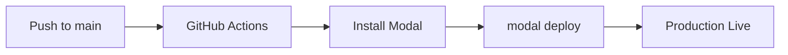

# Modal Deployment

Core documentation for deploying and managing Modal applications.

---

## CLI Commands

### Development

```bash
# Hot-reload development server
modal serve src/modal_app/app.py

# Run once (ephemeral)
modal run src/modal_app/app.py

# Run with arguments
modal run src/modal_app/app.py::main --arg1 value1
```

### Production

```bash
# Deploy to production (default environment)
modal deploy src/modal_app/app.py

# Deploy to specific environment
modal deploy src/modal_app/app.py --env dev
modal deploy src/modal_app/app.py --env staging
modal deploy src/modal_app/app.py --env prod
```

### Management

```bash
# List deployed apps
modal app list

# Stop an app
modal app stop my-app-name

# View logs
modal app logs my-app-name

# List secrets
modal secret list
```

---

## Environments

### Creating Environments

```bash
# Create development environment
modal environment create dev

# Create staging environment
modal environment create staging

# List environments
modal environment list
```

### Environment-Specific Deployment

```bash
# Deploy to dev
modal deploy --env dev src/modal_app/app.py

# Deploy to production (main/default)
modal deploy src/modal_app/app.py
```

### URL Patterns

| Environment | URL Pattern |
|-------------|-------------|
| Production | `https://{workspace}--{app}-{function}.modal.run` |
| Dev | `https://{workspace}-dev--{app}-{function}.modal.run` |
| Custom | `https://{workspace}-{env}--{app}-{function}.modal.run` |

**Example**:
```
Production: https://chris00walker--startupai-validation-fastapi-app.modal.run
Dev:        https://chris00walker-dev--startupai-validation-fastapi-app.modal.run
```

---

## GitHub Actions CI/CD

### Complete Workflow

```yaml
name: Deploy to Modal

on:
  push:
    branches:
      - main
  workflow_dispatch:  # Manual trigger

jobs:
  deploy:
    name: Deploy Modal App
    runs-on: ubuntu-latest
    env:
      MODAL_TOKEN_ID: ${{ secrets.MODAL_TOKEN_ID }}
      MODAL_TOKEN_SECRET: ${{ secrets.MODAL_TOKEN_SECRET }}

    steps:
      - name: Checkout Repository
        uses: actions/checkout@v4

      - name: Install Python
        uses: actions/setup-python@v5
        with:
          python-version: "3.11"

      - name: Install Modal
        run: |
          python -m pip install --upgrade pip
          pip install modal

      - name: Deploy to Modal
        run: modal deploy src/modal_app/app.py
```

### Multi-Environment Workflow

```yaml
name: Deploy to Modal

on:
  push:
    branches:
      - main
      - develop

jobs:
  deploy:
    runs-on: ubuntu-latest
    env:
      MODAL_TOKEN_ID: ${{ secrets.MODAL_TOKEN_ID }}
      MODAL_TOKEN_SECRET: ${{ secrets.MODAL_TOKEN_SECRET }}

    steps:
      - uses: actions/checkout@v4
      - uses: actions/setup-python@v5
        with:
          python-version: "3.11"

      - run: pip install modal

      - name: Deploy to dev (develop branch)
        if: github.ref == 'refs/heads/develop'
        run: modal deploy src/modal_app/app.py --env dev

      - name: Deploy to production (main branch)
        if: github.ref == 'refs/heads/main'
        run: modal deploy src/modal_app/app.py
```

### Setting Up Secrets

1. Go to https://modal.com/settings/tokens
2. Create a new token
3. Copy `MODAL_TOKEN_ID` and `MODAL_TOKEN_SECRET`
4. Add to GitHub repository secrets:
   - Settings → Secrets and variables → Actions
   - Add `MODAL_TOKEN_ID` and `MODAL_TOKEN_SECRET`

---

## Deployment Patterns

### Manual Deployment

```bash
# 1. Test locally
modal serve src/modal_app/app.py

# 2. Verify with curl
curl http://localhost:8000/health

# 3. Deploy to dev
modal deploy --env dev src/modal_app/app.py

# 4. Test dev endpoint
curl https://workspace-dev--app-function.modal.run/health

# 5. Deploy to production
modal deploy src/modal_app/app.py
```

### Automated Deployment



---

## Versioning

Each `modal deploy` increments the app version:

```bash
$ modal deploy src/modal_app/app.py
Deploying app 'my-app'
Created version 3
```

### Rollback

Currently, Modal doesn't support automatic rollback. To rollback:

1. Checkout previous commit
2. Redeploy: `modal deploy src/modal_app/app.py`

---

## Monitoring

### Dashboard

https://modal.com/apps

- View all deployed apps
- Monitor execution metrics
- View logs and errors
- Manage app lifecycle

### Logs

```bash
# View recent logs
modal app logs my-app

# Follow logs in real-time
modal app logs my-app --follow
```

### Health Checks

```python
@web_app.get("/health")
def health():
    return {
        "status": "healthy",
        "service": "my-app",
        "version": "1.0.0",
    }
```

---

## StartupAI Deployment

### Development Flow

```bash
# 1. Local development with hot reload
modal serve src/modal_app/app.py

# 2. Test endpoints
curl -X POST http://localhost:8000/kickoff \
  -H "Authorization: Bearer test-token" \
  -H "Content-Type: application/json" \
  -d '{"project_id": "...", "user_id": "...", "entrepreneur_input": "..."}'

# 3. Deploy to dev for integration testing
modal deploy --env dev src/modal_app/app.py

# 4. Deploy to production
modal deploy src/modal_app/app.py
```

### Production URLs

```
Health: https://chris00walker--startupai-validation-fastapi-app.modal.run/health
Kickoff: https://chris00walker--startupai-validation-fastapi-app.modal.run/kickoff
Status: https://chris00walker--startupai-validation-fastapi-app.modal.run/status/{run_id}
HITL: https://chris00walker--startupai-validation-fastapi-app.modal.run/hitl/approve
```

### GitHub Actions for StartupAI

```yaml
name: Deploy StartupAI Modal

on:
  push:
    branches: [main]
    paths:
      - 'src/modal_app/**'
      - 'src/crews/**'
      - 'src/state/**'
  workflow_dispatch:

jobs:
  test:
    runs-on: ubuntu-latest
    steps:
      - uses: actions/checkout@v4
      - uses: astral-sh/setup-uv@v3
      - run: uv sync
      - run: uv run pytest tests/

  deploy:
    needs: test
    runs-on: ubuntu-latest
    env:
      MODAL_TOKEN_ID: ${{ secrets.MODAL_TOKEN_ID }}
      MODAL_TOKEN_SECRET: ${{ secrets.MODAL_TOKEN_SECRET }}

    steps:
      - uses: actions/checkout@v4
      - uses: actions/setup-python@v5
        with:
          python-version: "3.11"
      - run: pip install modal
      - run: modal deploy src/modal_app/app.py
```

---

## Troubleshooting

### "App not found"

```bash
# List apps to verify name
modal app list
```

### "Token invalid"

```bash
# Re-authenticate
modal token set --token-id xxx --token-secret xxx
```

### "Deployment failed"

```bash
# Check logs for errors
modal app logs my-app

# Try with verbose output
modal deploy src/modal_app/app.py --verbose
```

---

## Related

- [Functions](functions.md) - Function configuration
- [Secrets](secrets.md) - CI/CD with secrets
- [StartupAI Patterns](startupai-patterns.md) - Ecosystem deployment
